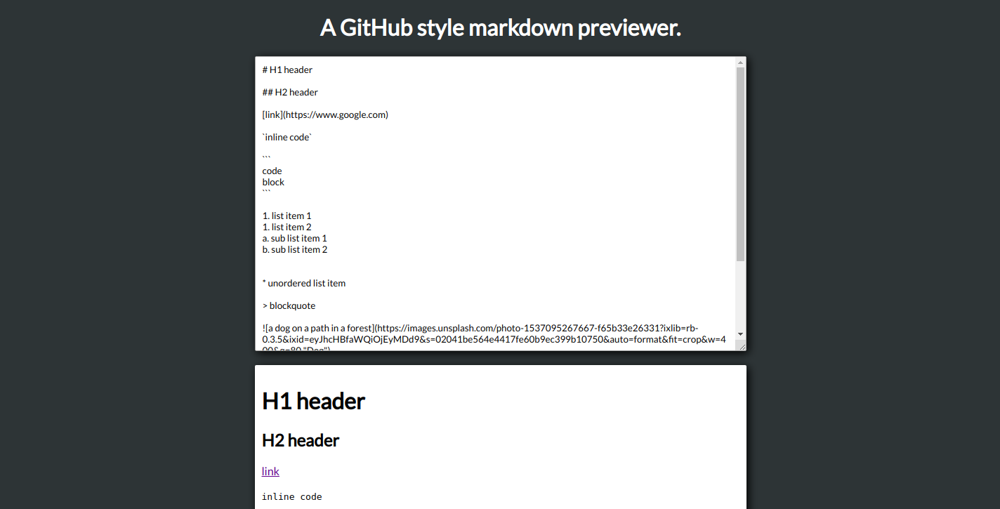

# Markdown Previewer

## Introduction
A GitHub style markdown previewer for writing readme files and checking the output on the fly.

This project is part of freeCodeCamps Frontend Libraries certificate.

## Project Requirements
* There is a textarea element with a corresponding id="editor".
* There is an element with a corresponding id="preview".
* Entering text into the #editor element updates the #preview element while typing to display the content of the textarea.
* Entering GitHub flavored markdown into the #editor element renders the text as HTML in the #preview element while typing. (HINT: You don't need to parse Markdown yourself - you can import the Marked library for this: https://cdnjs.com/libraries/marked).
* When the markdown previewer first loads, the default text in the #editor field should contain valid markdown that represents at least one of each of the following elements: a header (H1 size), a sub header (H2 size), a link, inline code, a code block, a list item, a blockquote, an image, and bolded text.
* When the markdown previewer first loads, the default markdown in the #editor field should be rendered as HTML in the #preview element.
* Optional Bonus (you do not need to make this test pass): When clicking a link rendered by my markdown previewer, the link is opened up in a new tab (HINT: read the Marked.js docs for this one!).
* Optional Bonus (you do not need to make this test pass): The markdown previewer interprets carriage returns and renders them as br (line break) elements.

## Project Data
Marked library:  
https://cdnjs.com/libraries/marked

## Final Project
https://myrmidonut.github.io/fcc_frontend_markdown

## Preview Images
### Main Screen:

